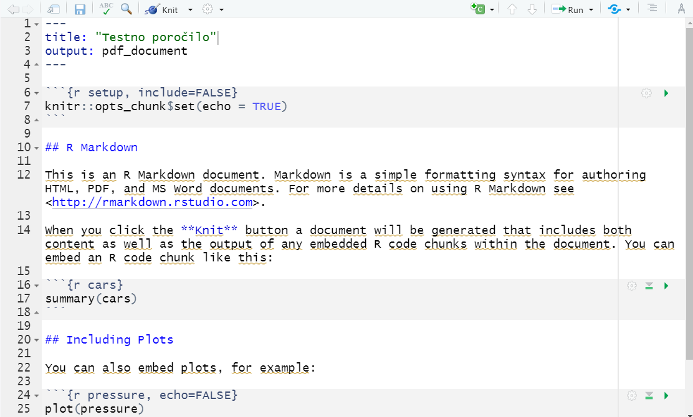

```{r setup, include=FALSE}
knitr::opts_chunk$set(echo = TRUE)
```

# 1.del - Analiza glavnih komponent - PCA


Analiza glavnih komponent se velikokrat uporablja v raznih analizah. Glavna ideja algoritma PCA je, da zmanjša dimenzionalnost prostora, tako, da poišče linearne kombinacije spremenljivk/atributov, ki so v novem prostoru pravokotne ena na drugo in razlagajo čimvečjo varianco  v podatkih.

PCA lahko uporabljamo le na zveznih spremenljivkah. V R-ju jo dobimo v paketu **stats** pod imenom `prcomp()`.

Poglejmo si preprosto uporabo na preprostih podatkih o perunikah.


```{r}
podatki <- iris
summary(podatki)
```
Za uporabo moramo le naložiti paket **stats** in pognati funkcijo. Če kdo želi si lahko ogleda tudi zelo podobno funkcijo `princomp()`, ki omogoča izbiro stolpcev z uporabo formule.

```{r}
library(stats)
pca <- prcomp(podatki[,1:4], scale=T)
screeplot(pca)
```

Zgornji diagram nam prikazuje, koliko variance razlaga vsaka dimenzija. Ponavadi pa želimo izrisati delež razložene variance. V ta namen bomo uporabili paket **factoextra**, ki zna izrisati grafe, ki se ponavadi uporabljajo pri PCA. Pogjemo si najprej osnovni graf.

```{r}
#install.packages("factoextra")
library(factoextra)
fviz_eig(pca)
```


Vidimo, da nam ta funkcija lepše izriše delež razložene variance.

Pogljemo si še graf spremenljivk, ki nam ga omogoča paket. Prispevki vsake spremenljivke so obarvani. Če dve spremenljivki kažeta v enako smer pomeni, da sta pozitivno korelirani, če pa v nasprotno sta negativno korelirani.


```{r}
fviz_pca_var(pca,
             col.var = "contrib", #Prispevek k razlagi latentne sprem.
             gradient.cols = c("blue", "yellow", "red"),
             repel = TRUE     
)
```

Poglejmo si še kako bi do nekaterih vrednosti dostopali programsko s čimer si nadaljnje omogočimo avtomatsko programsko analizo.

```{r}
names(pca)
```
Najbolj sta pomembni vrednosti **stdev** in **rotation**. Stdev nam poda standardne deviacije iz katerih lahko izračunamo varianco, rotacija pa nam pove, kako moramo zarotirati prostor, da dobimo preslikavo v nižje dimenzije.

Primer potrebne rotacije za prvo glavno komponento.

```{r}
pca$rotation[,1]
```
S funkcijo print dobimo ravno te osnovne podatke!

```{r}
print(pca)
```

Summary pa nam podata tudi delež razložene variance (Proportion of Variance).

```{r}
summary(pca)
```
Izračunajmo PoV sami.

```{r}
PoV <- pca$sdev**2/sum(pca$sdev**2)
PoV
```
V praksi vzamemo 2 ali 3 dimenzije, če želimo rezultat PCA izrisati ali pa vzamemo toliko glavnih komponent, da razložijo vsaj 80 odstotkov variance.


Primer, kako bi dobili število komponent, ki pokrije več kot 80 odstotkov variance avtomatsko.

```{r}
cumsum(PoV)
dimensions <- which(cumsum(PoV) >= 0.8)[1]
dimensions
```

Za izris lahko uporabimo že prej uporabljene pakete ali pa si podatke izrišemo samo. Pretvorimo naše podatke v dve dimenziji.

```{r}
rotation <- matrix(pca$rotation[1:dimensions,], 2, 4)
rotation
d <- as.matrix(iris[,1:4])
podatki2d <- t(rotation %*% t(d)) 
head(podatki2d)
```
V `rotation` smo shranili samo rotacije za prvi dve komponenti v `d` pa so naši originalni podatki. Funkcija `t()` transponira matriko, %*% pa je znak za matrično množenje. Podatke smo na koncu še enkrat transponirali, da smo dobili vsak podatek v svojo vrstico.

Izrišimo podatke v dveh dimenzijah. Najprej pretvorimo matriko v tibble.

```{r}
library(tidyverse)
podatki2d <- as_tibble(podatki2d)
podatki2d
```
Nato izrišemo.

```{r}
ggplot(podatki2d, aes(x = V1, y = V2, col = iris$Species)) + 
  geom_point()
```

Vidimo lahko, da ti dve dimenziji zelo dobro ločita tri različne vrste perunik.

Poglejmo si še uporabo na nekoliko težjemu in zanimivejšemu primeru. Iz paketa **mokken** bomo uporabili podatke 433 anketiranih študentov, ki so odgovoarjali na 218 vprašanj o svojih lastnostih. Vsako lasnost so rangirali od 0 do 4, kjer 0 pomeni nestrinanje s trditvijo, 4 pa popolno strinanje s trditvijo. Nekateri atributi imajo *, kar pomeni, da je bilo vprašanje negirano.

```{r, echo=FALSE}
#install.packages("mokken")
library(mokken)
data(acl)
```

```{r}
acl <- as_tibble(acl)
colnames(acl)[1:20]
```

Izvedimo PCA.

```{r}
pca <- prcomp(acl, scale = T)
fviz_eig(pca)
```

Namesto izrisa v dveh dimenzijah, si poglejmo, kako bi poiskali razlago privh petih glavnih komponent. To lahko storimo tako, da se s for zanko sprehodimo čez njih in pogledamo, katere vhodne spremenljivke imajo največji vpliv nanje.

```{r}
#razlaga latentnih spremenljivk
for (i in 1:5) #za prvih 5 dimenzij
{
  #za vsako latentno spremenljivko poiščemo 10 najbolj pomembnih atributov
  top_10 <- order(abs(pca$rotation[,i]), decreasing=T)[1:10]
  signs <- sapply(pca$rotation[top_10,i], function(x){if (x > 0) "+" else "-"})
  cat(paste(signs, names(pca$rotation[top_10,i]), sep=""), "\n")
}
```

Lahko izliščite pomen komponent? Mogoče: desparing, kind, extrovert, supportive, perfectionist?

# 2. del - Odstranjevanje odvečnih stolpcev, funkcije in zanke

Poglejmo si primer podatkov, kjer bi želeli dobiti podobnosti in razlike med skupinami in tudi detektirati podobne oziroma enake spremenljivke.

```{r}
primer <- tibble(vzorec = 1:6, 
                 skupina = c("A", "A", "B", "C", "A", "B"),
                 last_1 = c(0, 1, 1, 0, 0, 0),
                 last_2 = c(1, 0, 1, 1, 1, 0),
                 last_3 = c(1, 0, 1, 1, 1, 1),
                 last_4 = c(0, 0, 0, 1, 0, 1))
primer
```

Za analizo skupin, je atribut `skupina` zelo uporaben, saj lahko podatke groupiramo po različnih vrednostih atributov in na njih opravljamo analize.

Spodnji primer najprej naredi skupine po atributu `skupina`, nato pa za ta atribut izračuna povprečje in standardni odklon.

```{r}
primer %>% 
  group_by(skupina) %>% 
  summarise(mean_l1 = mean(last_1),
            sd_l1 = sd(last_1),
            n = n())
```

Z uporabo funkcije `across`, lahko enako opravimo za vse stolpce hkrati.

```{r}
#za vse lastnostni hkrati
primer %>% group_by(skupina) %>% 
  summarise(across(last_1:last_4, mean, .names = "{.col}_mean"),
            across(last_1:last_4, sd, .names = "{.col}_sd"), 
            n = n())
```

Če želimo zamenjati vrednosti NA, lahko uporabimo še `replace_na()`. V prejšnjem primeru smo uporabili tudi sintakso tidyverse, ki jo do sedaj še nismo uporabli, je pa primerna za avtomatsko generiranje imen atributov.

Od tukaj naprej verjetno lahko sami ugotovite ali sta dve skupini podobno porazdeljeni ali ne in jih po potrebi odstranite z funkcijo `filter()`.


Poglejmo si še kako bi zaznali, če se lastnosti ponavljajo. Za ta primer bomo uporabili nekoliko večji vzorec, ki bo avtomatsko generiran.

```{r}
st_vzorcev <- 10
primer <- tibble(vzorec = 1:st_vzorcev,
                 skupina = sample(c("A", "B", "C"), st_vzorcev, 
                        replace = T, prob = c(0.5, 0.3, 0.2)))
primer
st_lastnosti = 8
for(l in 1:st_lastnosti){
  lastnost <- sample(c(0,1), st_vzorcev, replace = T)
  primer <- primer %>% add_column("last_{l}" := lastnost)
}
primer
```

Ker je zgornji postopek uporaben, ga lahko zapišemo kot funkcijo, da ga lahko kasneje uporabljamo še drugje.

```{r}
generiraj_primer <- function(st_vzorcev = 10, st_lastnosti = 4){
  primer <- tibble(vzorec = 1:st_vzorcev,
                   skupina = sample(c("A", "B", "C"), st_vzorcev, 
                                    replace = T, prob = c(0.5, 0.3, 0.2)))
  for(l in 1:st_lastnosti){
    lastnost <- sample(c(0,1), st_vzorcev, replace = T)
    primer <- primer %>% add_column("last_{l}" := lastnost)
  }
  primer
}
```


Generirajmo le 5 vzorcev z 100 lastnostmi, da dobimo primer, kjer se bodo lasnosti ponavljale.

```{r}
set.seed(1234)
primer <- generiraj_primer(5, 100)
primer
```


Če sta dve lastnosti enaki lahko preporsto preverimo na spodnji način.

```{r}
primer$last_1 == primer$last_2
all(primer$last_1 == primer$last_2)
```

Zapakirajmo še to v svojo funkcijo. Sicer v R-ju že obstaja funkcija `identical()`, vendar bomo svojo kasneje nadgradili.

```{r}
enaka <- function(last_a, last_b){
  all(last_a == last_b)
}
```


```{r}
enaka(primer$last_1, primer$last_2)
```

Sedaj moramo le dobiti način, kako preverimo vse kombinacije spremenljiv in na njih poženemo izbrano funkcijo. V pomoč nam je lahko `combn`, ki nam izpiše vse kombinacije vrednosti iz prvega argumenta.

```{r}
combn(1:5, 2)
```

Recimo, da si zamislimo analizo, ki bo potekalo po spodnjem postopku.

```{r, eval = FALSE}
#želimo
unikatne_lasnosti <- primer %>% 
  dplyr::select(starts_with("last")) %>% 
  odstrani_enake()
```

Potrebujemo funkcijo, ki nam bo odstranila enake stolpce. Napišimo jo s pomočjo for zanke.

```{r}
odstrani_enake <- function(df){
  st_stolpcev <- ncol(df) #poglej število stolpcev
  moznosti <- t(combn(1:st_stolpcev, 2)) #naštej možnosti
  obdrzim <- 1:st_stolpcev #predposavi, da obdržiš vse
  for(i in 1:nrow(moznosti)){ #za vsako kombinacijo
    a <- moznosti[i,1] #izberi stolpec a (indeks)
    b <- moznosti[i,2] #izberi stolpec b (indeks)
    if(enaka(df[,a], df[,b])){ #preveri, če sta stolpca a in b enaka
      obdrzim <- setdiff(obdrzim, b) #če sta enaka, ga odstrani
    }
  }
  df[,obdrzim] #vrni le stolpce, ki jih nameravamo obdržati
}
```

Preverimo, če funkcija deluje.

```{r}
unikatne_lasnosti <- primer %>% 
  dplyr::select(starts_with("last")) %>% 
  odstrani_enake()
unikatne_lasnosti
```

Če izpišemo imena, hitro opazimo, katere lastnosti smo odstranili.

```{r}
names(unikatne_lasnosti)
```

Zgornji primer je mogoče nekoliko kompleksen, vendar smo z njim želeli prikazati še uporabo funkcij in zank. Je pa dokaj fleksibilien, saj ga lahko hitro dopolnimo.

Kaj pa če smatramo tudi inverza za enaka. Primer 1,1,1,0 == 0,0,0,1?

Samo posodobimo funkcijo `enaka()`.

```{r}
enaka <- function(last_a, last_b){
  popolnoma_enaka <- all(last_a == last_b)
  inverzna <- all(last_a != last_b)
  return(popolnoma_enaka | inverzna)
}
```

```{r}
unikatne_lasnosti <- primer %>% 
  dplyr::select(starts_with("last")) %>% 
  odstrani_enake()

names(unikatne_lasnosti)
```

Sestavimo originalno obliko podatkov, a le z izbranimi stolpci.

```{r}
primer %>% dplyr::select(vzorec, skupina) %>% add_column(unikatne_lasnosti)
```

Lahko pa odstranimo podobne. Tiste pri katerih je korelacija dovolj visoka. Generirajmo primer z veliko primeri in dokaj malo lasnostmi za lažji izris korelacijske tabele.


```{r}
primer <- generiraj_primer(1000, 10)
primer
```
Korelacije med spremenljivkami lahko dobimo z funkcijo `cor()`.
```{r}
primer %>% dplyr::select(last_1:last_10) %>% cor()
```
Lažje je, če si za dokaj nizko števlo dimenzij korelacije izrišemo.

```{r}
library(ggcorrplot)
korelacije <- primer %>% dplyr::select(last_1:last_10) %>% cor()
ggcorrplot(korelacije, method = "circle", type = "upper", lab = T)
```
Posodobimo funkciji, da bomo lahko z enako kodo kot prej odstrani preveč podobne lastnosti.

```{r}
#mogoče bi bilo boljše ime - podobna
enaka <- function(last_a, last_b, meja_korelacije = 0.9){
  korelacija <- abs(cor(last_a, last_b))
  return(korelacija >= meja_korelacije)
}

```

Posodobimo funkciji z argumentom `...`, ki omogoča prenašanje argumentov drugim funkcijam.

```{r}
odstrani_enake <- function(df, ...){
  st_stolpcev <- ncol(df)
  moznosti <- t(combn(1:st_stolpcev, 2))
  obdrzim <- 1:st_stolpcev
  for(i in 1:nrow(moznosti)){
    a <- moznosti[i,1]
    b <- moznosti[i,2]
    if(enaka(df[,a], df[,b], ...)){
      obdrzim <- setdiff(obdrzim, b)
    }
  }
  df[,obdrzim]
}
```

```{r}
unikatne_lasnosti <- primer %>% 
  dplyr::select(starts_with("last")) %>% 
  odstrani_enake(meja_korelacije = 0.05)
unikatne_lasnosti
```
Če želite stolpec skupina pretvoriti v "prisotnosti-odsotnosti" lahko to na kratek način naredimo z `pivot_wider()`. Postopek je znan tudi pod imenom one-hot encoding.

```{r}
primer <- generiraj_primer(5, 2)
primer %>% mutate(ena = 1) %>% 
  pivot_wider(names_from = skupina, values_from = ena, values_fill = 0)
```

# 3.del - R projekt dobra praksa

## Struktura projekta

Večina projektov v jeziku R vsebuje iste korake: branje nekih podatkov, preoblikovanje in analiza podatkov in pridobivanje rezultatov v obliki obdelanih podatkov, grafov.
Osnovna struktura vsakega projekta naj bi izgledala približno tako (povzeto iz spletne strani (https://www.r-bloggers.com/2018/08/structuring-r-projects/)): \
.
└── my_awesome_project \
    ├── src \
    ├── output \
    ├── data \
    │   ├── raw \
    │   └── processed \
    ├── README.md \
    └── run_analyses.R 


Dobro je imeti vse datoteke  povezane z enim projektom v eni mapi razdeljeni v podmape. V zgornji strukturi imamo mapo za podatke (data) v kateri sta mapi za surove (raw) in processed (predobdelani podatki), 
mapa v kateri je R koda za izvajanje raznih operacij (src) in mapa za rezultate (output). V skripti *run_analysis.R* 
je glavni del naše kode v katerem kličemo funkcije iz mape src.

Dobro je imeti vsaj dve mapi za podatkte. Surovi podatki so shranjeni v svoji mapi in se nikoli ne spreminjajo, to mapo uporabljamo izrecno samo za branje, medtem ko so ostale mape namenjene podatkom, ki jih ustvarimo tekom svojega dela.


V mapi src hranimo datoteke z našo R kodo. Kaj damo v posamezno datoteko je odvisno od našega projekta. Dobro je, da hranimo funkcije, ki jih sami definiramo v enih datotekah in skripte, ki nekaj naredijo (uporabijo definirane funkcije) v drugih datotekah. Dobro je kodo razdeliti med različne datoteke, da jo je v vsaki datoteki omejeno število vrstic, saj je tako vzdrževanje kode lažje. Včasih je priporočljivo, da damo vsako funkcijo v svojo datoteko oziroma le funkcije, ki so si sorodne v skupno datoteko. Tukaj pazimo, da damo datotekam informativne imena, ki nam povejo, kakšne funkcije so shranjene v datoteki. Če je datotek s funkcijami veliko jih je dobro razdeliti v mape, v vsaki mapi naj bodo sorodne funkcije. Če je projekt majhen lahko imamo glavno kodo, ki kliče funkcije le v eni datoteki, ta je lahko shranjena kar v glavi datoteki projekta.

V mapi output hranimo vse izhode naše kode. Dobro je, da so generirani grafi v ločeni mapi od npr. generiranih tabel.

## Splošni napotki
- Če želimo uporabiti samo eno funkcijo iz določene knjižnice nam ni treba naložiti celotni paket. Na primer, če želimo funkcijo, ki izračuna mediane vrednosti stolpcev namesto, da najprej naložimo paket **library(MatriStats)** 
kličemo le funkcijo iz paketa kot: **matrixStats::rowMedians()**. Če želimo uporabiti mnogo funkcij iz paketa naložimo cel paket npr. **library(tidyverse)**. Če nalagamo pakete enega za drugim in imajo paketi funkcije z istim imenom, lahko povozimo eno funkcijo z drugo.

- Dobro je, da definiramo vse pakete in "uvoženo" kodo (funkcije iz drugih datotek) na začetku kode. Isto velja za kakšne globalne spremenljivke, katerih vrednosti so dostopne povsod.

- Ko definiramo svoje funkcije, jim ne damo ista imena, kot že obstoječimi funkcijami v R-ju, saj jih bomo s tem povozili.

- Komentiramo čimveč. Komentarji so dobrodošli povsod. Še bolj dobrodošli so pa tam, kjer imamo neko originalno rešitev, za katero ni takoj očitno, kaj dela. Za funkcije si je dobro napisati kaj sprejmejo in v kakšni obliki in kaj vračajo. Komentiramo zato, da lahko drugi uporabljajo našo kodo in da jo lahko sami razumemo šez nekaj časa.

- **ZELO POMEMBNO** Vsakič, ko kakšen postopek ponovimo ne kopiramo kode. Uporabljamo zanke in kodo, ki jo želimo večkrat uporabiti zapakiramo v funkcijo.

- Pred zaprtjem RStudio vpraša, če shrani delovno okolje. Delovno okolje načeloma ne shranimo, saj želimo dobiti vsakič isti rezultat z zagovom svoje kode, zato vmesnih spremenljivk, ki jih ne shranimo v datoteko, ne shranjujemo.


## RMarkdown

<style>
.DSout {
  border: 2px solid gray;
  padding: 3px
}
</style>

# Dinamična poročila v R Markdown
Priprava poročil je velikokrat zamuden proces. Poleg tega z orodji kot so Word, Excel in PowerPoint težko na jasen in učinkovit način vstavljamo, naš potek dela in dele kode, ki smo jih uporabili med analizo. Ravno s tem namenom se je razvil R Markdown, ki nam omogoča pripravo dinamičnih poročil z vključitvijo kode in njihovih rezultatov, kot so grafi, tabele ter tudi drugi objekti, s katerimi se pogosto srečujemo med analizo.

V tem predavanju bomo spoznali glavne zmogljivosti R Markdown dokumentov in kako lahko na preprost način sestavimo napredna poročila naših analiz. R Markdown je mešanica programskega jezika R in označevalnega jezika Markdown. Označevalji jezik (*angl. markup language*) je skupek ukazov, ki določajo, v kakšni obliki in formatu naj se besedilo prikaže v dokumentu. Na razliko od drugih označevalnih jezikov (HTML, LaTex, XML, ...), je Markdown zelo jasen in berljiv. Vedno več se ga uporablja za pisanje blogov, forumov, dokumentacij in poročil.

## Namestitev paketov
V pripravi si bomo namestili R Markodwn v RStudio in na kratko pregledali osnovne ukaze R Markdown-a. Za namestitev R Markdown-a v RStudio vtipkamo v konzolo naslednji ukaz:

```{r eval = FALSE}
install.packages("rmarkdown")
```

V primeru, da bi želeli poročila prikazati tudi v format PDF, moramo namestiti tudi eno izmed LaTeX distribucij. Najenostavneje je, da si naložite "TinyTex" direktno iz konzole:

```{r eval = FALSE}
tinytex::install_tinytex()
```
Ustvariti naš prvi R Markdown dokument: kliknemo na *File -> New File -> R Markdown*". V oknu, ki se nam pojavi, vtipkamo v ime dokumenta "Testno poročilo" in izberemo "PDF" za output format. Na levi strani pustimo tip dokumenta "Document". Ko stisnemo gumb "OK" se nam odpre nova skripta na spodnji sliki z osnovnimi navodili in primeri uporabe.

<div style= "border : 2px solid gray" style = "padding: 3px">

</div>

R Markdown besedila so shranjena s končnico *Rmd*. Opazimo lahko, da bo vsak R Markdown dokument imel tudi svojo unikatno orodno vrstico na vrhu skripte, podobno, kot Shiny R aplikacije. 

Na vrhu dokumenta imamo najprej odsek besedila, ki ga na začetku in koncu omejujejo tri zaporedni pomišljaji. To je glava dokumenta, ki vsebuje glavne nastavitve, kot so naslov, ime avtorja, datum in format, v katerega bomo prevedli končni dokument (*nastavitve so v YAML formatu, zato moramo biti previdni z zavihki*). Na spodnji sliki smo dodali še ime avtorja in datum.

<div style= "border : 2px solid gray" style = "padding: 3px">

</div>

Pomen ostalih ukazov, ki so vidni od tukaj dalje bomo obravnavali posebej. Za začetek poskušajte dokument *Splesti* s pritiskom na gumb *Knit* v orodni vrstici. V konzoli bi morali opaziti, da se dokument prevaja v izbran format, v našem primeru pdf. Če vse deluje pravilno se vam bo po nekaj sekundah odprl spodnji dokument. Dokument se nahaja v mapi, kjer ste imeli shranjeno prvotno Rmd skripto.

<div style= "border : 2px solid gray" style = "padding: 3px">

</div>

## Osnovni Markdown ukazi

Za začetek si bomo na kratko pogledali glavne ukaze v označevalnem jeziku Markdown. Najprej iz dokumenta izbrišemo ves tekst in pustimo le glavne nastavitve:

```
---
title: "testno_porocilo"
author: "DataScience@UL-FRI"
date: "08/10/2021"
output: pdf_document
---
```
***


Od tukaj dalje bo v sivem okvirju tekst, ki je namenjen temu, da ga napišete v vaš *Rmd* dokument. Z rdečo obrobo pa je označen odsek, ki je rezultat teh Markdown ukazov.

Dodajmo najprej naslov in nekaj besedila:

```{}
# Prvo poglavje
Napisali smo naše prvo poglavje v Markdown-u.
```

<div class =DSout>
# Prvo poglavje {-}
Napisali smo naše prvo poglavje v Markdown-u.
</div>

Kot vidimo naslov označimo na začetku vrstice z lojtro, ki ji sledi presledek ('#&nbsp;'), preostali tekst pa se normalno izpiše.

Če želimo sedaj dodati podpoglavja to storimo tako, da dodamo več lojtr. Primer:

```
# Prvo poglavje
Napisali smo naše prvo poglavje v Markdown-u.  
Nov odstavek pa začnemo tako, da v predhodno vrstico dodamo dva presledka.
Če dodamo samo enega ali nič, se stavek le nadaljuje.  

Odvečne    presledke    Rmarkdown odstrani.

# Drugo poglavje 
## Prvo podpoglavje
## Drugo podpoglavje
### Podpogavlje podpoglavja
```

<div class=DSout>
# Prvo poglavje{-}
Napisali smo naše prvo poglavje v Markdown-u.  
Novo vrstico pa začnemo tako, da v predhodno vrstico dodamo dva presledka. 
Če dodamo samo enega ali nič, se stavek le nadaljuje.

Odvečne    presledke    Rmarkdown odstrani.

# Drugo poglavje  {-}
## Prvo podpoglavje {-}
## Drugo podpoglavje {-}
### Podpogavlje podpoglavja{-}
</div>

Besede lahkko poudarimo z uporabo zvezd ali podčrtajev:
```
*pišemo* _ležeče_ ali pa **krepke** __črke__ ali pa ~~prečrtamo~~.

```
<div class=DSout>
*pišemo* _ležeče_ ali pa **krepke** __črke__ ali pa ~~prečrtamo~~.
</div>


Markdown preprosto oblikuje tudi sezname:

```
1. Prva beseda
2. Druga beseda
3. Tretja beseda
- Lepa beseda
- Grda beseda
- Prijazna beseda
```
<div class=DSout>

1. Prva beseda
2. Druga beseda
3. Tretja beseda
- Lepa beseda
- Grda beseda
- Prijazna beseda
</div>

Uporabljamo lahko tudi LaTex notacijo za vpeljavo formul:

```
Formula za ploščino kroga je: $A = \pi r^2$
```

<div class=DSout>
Formula za ploščino kroga je: $A = \pi r^2$
</div>

Krajše razpredelnice lahko vpišemu tudi ročno. Kasneje boste spoznali boljši način, kako podatke črpamo in prikažemo direktno iz baze.

``` 
Mesto     | Kratica | Prebivalstvo
:--------:| :-----: | :----------:
Ljubljana |    LJ   | 279,631
Koper     |    KP   | 25,753
Celje     |    CE   | 37,872
Maribor   |    MB   | 94,370
``` 
<div class=DSout>
Mesto     | Kratica | Prebivalstvo
:--------:| :-----: | :----------:
Ljubljana |    LJ   | 279,631
Koper     |    KP   | 25,753
Celje     |    CE   | 37,872
Maribor   |    MB   | 94,370

</div>

Dodamo lahko tudi opombe ali citate. Tukaj prikažemo samo opombo, če pa imate veliko citatov lahko uporabite tudi pakete namenjene prav citiranju kot sta __bibtex__ in __RefManageR__.
```
> "Only two things are infinite, the universe and human stupidity, and I'm not sure about the former."  
> - Albert Einstein

Primer opombe [^1].

[^1]: Opomba.
```
<div class=DSout>
> "Only two things are infinite, the universe and human stupidity, and I'm not sure about the former."  
> - Albert Einstein

Primer opombe [^1].

[^1]: Opomba.

</div>

Dodamo lahko tudi spletne povezave in slike.
```
Oglejte si spletno stran [DataScience](https://datascience.fri.uni-lj.si/).


```

<div class=DSout>
Oglejte si spletno stran [DataScience](https://datascience.fri.uni-lj.si/).


</div>

Za ostale posebne znake in pravila v Markdown-u si lahko pomagamo s ["cheat sheet-om"](https://www.markdownguide.org/cheat-sheet/).

## R Markdown
R Markdown je orodje, ki nam omogoča dinamično izvajanje R kode znotraj Markdown dokumentov. Glavna prednost tega pristopa je, da programsko kodo opravljene analize lahko na lep način opremimo z rezultati kode in našim opisom. Vsakič, ko spletemo R Markdown poročilo, se vsi kodni izseki izvedejo od začetka do konca, kar spodbuja in omogoča ponovljivost naših analiz. Poleg tega, končno poročilo lahko izvozimo v različne formate, od PDF poročil, Word dokumentov in html spletnih strani. V večini primerov bodo strani izgedale identično, razen majnih specifik, ki jih izhodni format mogoče ne podpira.

V pripravi na predavanje smo že povedali, da poročilo spletemo (ali prevedemo) v končni format s pritiskom na gumbom "Knit". Nismo pa omenili, da je ob vsakem prevajanju koda v svoji novi začasni R seji, kar omogoča popolno ponovljivost. To se pravi, da spremenljivke in funkcije, ki jih imamo definirane v trenutni R seji v RStudio-u (*tiste, ki smo definirali preko konzole*), ne bodo prišle v poštev med izvajanjem kode. Dobro je tudi , da se zavedamo, da nova R seja privzame za delovnego okolje lokacijo mape, v kateri se nahaja poročilo, tako da vemo kam shraniti potrebovane vhodne podatke in slike.

### Odseki kode

Temu sledi kos R kode, ki ga omejujejo tri zaporedni krativci (znak \`). Med vijugastima oklepajema pa so zapisani parametri, ki določajo programski jezik, ime kodnega odseka in obliko izpisa.

V pripravi smo se že srečali z odseki ali bloki kode (*angl. code chunks*), ki so bili vmeščeni med vrstice označene z tremi zaporednimi znaki \`. Prazen blok izgleda takole:

<div style= "border : 2px solid gray" style = "padding: 3px">

</div>

Nov kos kode lahko preprosto dodamo z bližnjico `Ctrl + Alt + I` ali pa s klikom na gumb "Insert" (zgoraj desno). Črka r znotraj zavitih oklepajev v prvi vrstici pomeni, da je to blok kode, ki izvaja R programski jezik. Markdown podpira tudi veliko drugih jezikov. V zavitih oklepajih lahko poleg jezika definiramo tudi ime odseka in parametre, ki določijo prikaz našega kosa kode in njegovega izračuna. Glavni paramtetri s katerimi se bomo večkrat srečali so:

- **echo**: FALSE pomeni, da se koda ne prikaže v končnem dokumentu (privzeto TRUE)
- **include**: FALSE pomeni, da se v končnem dokumentu ne prikaže koda niti ne rezultati. Kljub temu, da se koda ne prikaže se še vedno izvede. (privzeto TRUE)
- **eval**: FALSE pomeni, da se koda ne izvede, in če je `echo = T` se pokaže. Uporabno za prikaz kode z napakami. (privzeto TRUE)
- **collapse**: Prikaz kode in njegovega izhoda združimo v en izpis. (privzeto FALSE)
- **fig.width**, **fig.height**, **fig.allign**, **fig.cap**: širina, višina, poravnava in opis slike.

Poglejmo si primer istega kosa kode, ki izpiše tekst, kjer prej nastavimo parameter `collapse = T`, nato pa `collapse = F`:

<div style= "border : 2px solid gray" style = "padding: 3px">

</div>

<div class=DSout>
```{r collapse=T}
print("Primer bloka kode!")
```
</div>

In z `collapse = F`:

<div class=DSout>
```{r collapse=F}
print("Primer bloka kode!")
```
</div>
Kot vidimo je v končnem dokumentu (temle) izpis v drugem primeru razdeljen na dva dela, v prvem pa je v enem delu. Posamezne bloke kode lahko tudi med pisanjem poganjamo in rezultat se nam po pojavik kar znotraj RStudia, kar nam veliko pohitri pisanje dokumenta. To naredimo z gumbi, ki so v zgornjem desnem kotu vsakega kosa. Trikotnik požene trenutni blok, trikotnik nazvdol in kvadrat požene vse bloke do treutnega v dokumentu. Z pritiskom na kolešček, pa lahko nastavimo prej omenjene nastavitve bloka (eval, echo, itd.) in tudi druge.

Primer izpisa znotraj RStudia:

<div style= "border : 2px solid gray" style = "padding: 3px">

</div>


### Spremenljivke

Med prevajanjem se odseki kode izvajajo in hranijo, kot pri navadnih R skriptah. To pomeni, da se vse spremenljivke, funkcije in vmesni rezultati v R seji hranijo in sproti posodabljajo in so na voljo za kasnejšo uporabo znotraj dokumenta. Če želimo spremenljivke uporabljati izven kodnega bloka uporabimo \` r \ <ime_spremenljivke \>\`. S tem pristopom lahko krajše izračune dodamo, kar v tekst. Poglejmo, kaj nam vrne koda na naslednji sliki.

<div style= "border : 2px solid gray" style = "padding: 3px">

</div>

<div class=DSout>

```{r}
# Definiramo novo spremenljivko:
a <- 24
```

Dvakratna vrednost spremeljivke a je `r (2 * a)`.

</div>


Če pa spremenljivke ne bi definirali, bi nam blok kode vrnil napako:
<div class=DSout>
```{r collapse=T, warning=TRUE, error=TRUE}
print(b)
```
</div>

Zgornji izpis lahko dobite, če želite izpisati spremenljivko `b` ali pa v blok, ki definira `a`, podate bloku zavnodilo `eval = F`.

### Grafi

V poročilih se skoraj vedno poslužujemo razčičnih vizualizacij, da na kratko in učinkovito povzamemo glavne informacije skrite v podatkih, ali pa da prikažemo rezultate naše analize. V R Markdown-u grafe lahko na preprost način prikažemo tako, da dodamo kodni odsek, ki vsebuje kodo za pripravo grafa. Poglejmo si primer grafa z uporabo knjižnice _ggplot2_.

```{r include=FALSE}
library(ggplot2)
```

```{r fig.cap="Primer dinamičnega grafa.", message=FALSE}
# Naložimo podatke
df <- read.csv("./data-raw/osebe.csv", header = T,)
# Prikažemo graf
ggplot(df, aes( x = visina, y = teza, color = spol)) + geom_point(size = 2) + 
    geom_smooth(aes( x = visina, y = teza, fill = "Linear Trend"),  method = "lm", inherit.aes = F) + ggtitle("Višina v odvisnosti od teže.")
```

Pri tem izpisu je skrito, da je kodni blok vseboval `fig.cap="Primer dinamičnega grafa."`, ter pred tem je skrit blook z ukazom `library(ggplot2)`, ki pa ga z uporabo `include = FALSE` nismo prikazali. S tem se izignemo prikazu nalaganja paketov v dokumentov, vseeno pa so paketi naloženi.

Če želimo prikakzati dva grafa stran ob strani dodamo parametra `out.width = '50%'` in `fig.show = 'hold'`, kot je prikazano spodaj.

```{r fig.width=5, fig.height=5, out.width='50%', fig.show='hold'}
ggplot(data = df, aes(x = spol, y =  visina, fill = spol)) + geom_bar(stat = "summary", fun = mean) + ggtitle("Povprečna višina za vsak spol.")
ggplot(data = df, aes(x = spol, y =  teza, fill = spol)) + geom_bar(stat = "summary", fun = mean) + ggtitle("Povprečna teža za vsak spol.")
```

Če pa imamo shranje grafe ali druge slike (v obliki *png*, *jpeg* ali *pdf*) in za njih njimamo izvorne kode, ker smo jih naprimer dobili od drugih, jih v dokument vključimo z funkcijo `include_graphics()` paketa `knitr`:

```{r}

```

V zgornjem primeru "::" pomeni, da želimo funkcijo `include_graphics()` iz paketa `kntir`, pri tem pa nam paketa niti ni potrebno predhodno naložiti.

### Razpredelnice

Razpredelnice v R Markdown-u lahko na pregleden način ustavarimo s funkcijo `kable`, ravno tako iz paketa `knitr`.

```{r, message=F, warning=F, out.width='60%'}
knitr::kable(head(df), )
```

V `df` so shranjeni podatki oseb iz enega izmed predhodnih blokov.


# 4.del - Exploratory data analysis
V tem delu bomo simulirali Exploratory Data Analysis (EDA). Uporablili bomo statistične podatke o Covidu v Sloveniji, ki so na voljo na spletni strani   [Sledilnika]("https://raw.githubusercontent.com/sledilnik/data/master/csv/stats.csv"). Cilj je, da se spoznamo s podatki, jih preuredimo v obliko za lažje delo in poskušamo izluščiti trende iz njih. Podatke bomo za potrebe prikazovanja nekaterih funkcij tudi dodatno še nekoliko popačili z manjkajočimi vrednostmi.

## Naložimo Podatke

Najprej naložimo podatke. To lahko storimo z uporabo funkcije `curl`, ki podatke prenese kar iz uradne strani.

```{r message=F, warning=F}
library(tidyverse)
library(curl)
library(lubridate)
select <- dplyr::select
set.seed(1234)

df <- read_csv(curl("https://raw.githubusercontent.com/sledilnik/data/master/csv/stats.csv"))
```
Če smo pozorni na izpis vidimo, da imamo 129 zveznih atributov, 6 logičnih, en datum in en nominalni atribut.

Poglejmo, kako ti podatki izgledajo:
```{r}
df
```
Že takoj lahko opazimo, da imamo v nekaterih stolpcih kar veliko manjkajočih vrednosti. Opazimo tudi, da vsaka vrstica prikazuje meritve za en dan, kar lahko pojasni manjkajoče podatke. Saj vseh meritev niso opravljali na začetku. Vseeno bomo dodali še nekaj manjkajočih podatkov, da simuliramo šum oziroma naključne izpade meritev.


```{r}
# Podatke malce pokvarimo
make_NA <- function(x, pctg = 0.05){
  "x = vector, pctg = percentage of data that will become NA"
  n = length(x)
  indices <- sample(1:n, n%*%pctg, replace = T)
  x[indices] <- NA
  return(x)
}
df <- df %>% mutate(across(.cols = everything(), make_NA))
```


Bolj podrobno si poglejmo še zadnje dni:
```{r}
print(tail(df), width = Inf)
```
Opazimo, da so imena stolpcev logično povezana v kategorije. Stolpce zlahka ločimo po kategorijah glede na prvo besedo njihovega imena.

Za vsako kategorijo bomo zato ustvarili manjšo tabelo, ki bo bolj pregledna. Pri tem bomo spremenljivko phase izpustili, day in date pa bomo uporabili kot ključe, da lahko kasneje tabele s stiki povežemo nazaj v celoto. Od tukaj naprej se bomo analize lotili le na parih tabelah. Ostale si lahko ogledate in uredite sami.

Razbijmo sedaj podatke na več manjših tabel:
```{r}
testi     <- select(df, day, date, starts_with("tests.")) 
okuzbe    <- select(df, day, date, starts_with("cases."))
regije    <- select(df, day, date, starts_with("region.")) 
stanje    <- select(df, day, date, starts_with("state.")) 
starost   <- select(df, day, date, starts_with("age."))
smrti     <- select(df, day, date, starts_with("deceased."))
cepljeni  <- select(df, day, date, starts_with("vaccination."))
```

## Vizualizacija 1 - Stanja bolnišnic

Poglejmo si najprej tabelo *stanje*, ki prikazuje število pacientov v bolnišnicah.
```{r}
print(stanje, width = Inf, n = 20)
colnames(stanje)
```
Ko pogledamo razpredelnico *stanje* opazimo, da na začetku vsebuje nekaj vrstic, ki vsebujejo samo manjkajoče vrednosti, nato pa se NA-ji pojavljajo sporadično. Manjkajoče vrednosti so lahko problematične pri obdelavi in jih je zato velikokrat smiselno nadomestiti s smiselnimi vrednostmi. Opazimo tudi, da stolpci, ki vsebujejo niz ".todate" v imenu, predstavljajo kumulativne vrednosti. Kumulativne vrednosti ne predstavljajo problema, niso pa uporabne pri prikazovanju trendov. To lahko opazimo v spodnjem primeru:

```{r, out.width="49%", fig.show="hold"}
x <- c(1, 2, 1, 2, 3, 4, 5, 8, 9, 10, 7, 3, 1, 1, 4, 5, 7, 4, 3, 1)
kum_x <- cumsum(x)

y <- seq(1, length(kum_x))
podatki <- tibble(x=x,y=y,kum_x=kum_x)

ggplot(podatki, aes(y, x)) + geom_line()
ggplot(podatki, aes(y, kum_x)) + geom_line()
```

Za izris grafov uporabimo knjižnico **ggplot**, ki je del knjižnice **tidyverse**.V zgornjem primeru opazimo, da v prvem grafu (navadnih podatkih) imamo dva ločena vrha, medtem ko pri kumulativnih podatkih vrha nista očitna, saj krivulja stalno narašča. Zato bomo v nadaljevanju spremenili vse kumulativne vrednosti v  "dnevne vrednosti", tako da bomo izračunali razlike vrednosti glede na prejšnji dan.


### Čiščenje manjkajočih vrednosti

Začnimo z nadomeščanjem manjkajočih vrednosti (NA). Pomagali si bomo s paketom *zoo*. Če pogledamo razpredelnico *stanje*, opazimo, da prvih 15 vrstic vsebuje le manjkajoče vrednosti. Te vrstice so za nas popolnoma neuporabne, zato jih odstranimo.

```{r}
stanje <- filter(stanje, day >= 7)
```

Nato, nam preostanejo le sporadične manjkajoče vrednosti. Za stolpca `day` in `date` lahko manjkajoče vrednosti popravimo tako, da vzamemo vrednost iz prejšnje vrstice in prištejemo 1 dan. Za to bomo uporabili funkcijo `lag`, ki prebere vrednost iz prejšnje vrstice. To seveda lahko storimo, ker imamo malo manjkajočih vrednosti, če bi imeli tudi po več zaporednih manjkajočih vrednosti bi lahko na novo zgenerirali datume ali pa ta postopek ponovili večkrat.

```{r}
stanje <- mutate(stanje, 
                 date = ifelse(is.na(date), lag(date) + days(1), ymd(date)),
                 date = as_date(date),
                 day = ifelse(is.na(day), lag(day) + 1, day))
```

Datumi so sedaj popravljeni.

Za ostale spremenljivke pa nadomeščanje manjkajočih vrednosti v našem primeru ni tako enostavno. Standardne metode, kjer vse vrednosti zamenjamo z 0 ali pa s povprečno vrednostjo v tem primeru niso najbolj smiselne. Tu seUporabili bomo funkcijo `na.spline` iz paketa *zoo*, ki aproksimira manjkajoče vrednosti. Aproksimacije so realna števila izračunana iz sosednjih vrednosti. Aproksimacije bomo ponovno spremenili v cela števila s funkcijo `as.integer`.

```{r}
library(zoo)
stanje <- mutate(stanje, across(starts_with("state."), na.spline),
                 across(starts_with("state."), as.integer))
stanje
```

Na koncu pa še preverimo, če smo odstranili vse NA-je:

```{r}
apply(stanje, 2, function(x){sum(is.na(x))})
```

### Spremenimo kumulativne vrednosti v navadne
Kumulativa *state.in_hospital.todate* nam ne pove veliko. Če gledamo samo razlike od prejšnjega dne, dobimo podatek o številu na novo sprejetih pacientih, kar je za nas veliko bolj zanimivo.

Za spremembo kumulativnih vrednosti v navadne vrednosti, moramo vsaki vrednosti odšteti vrednost prejšnjega dne. Torej moramo narediti obraten postopek, kot pri računanju kumulativnih vrednosti. Tudi v tem primeru bomo uporabili funkcijo `lag`. Funkcija `lag` bo za prvo vrstico vrnila NA, zato moramo biti previdni in začetni NA nadomestiti z 0.
```{r}
stanje <- stanje %>%
  mutate(across(ends_with(".todate"), ~ . -lag(.))) %>%
  mutate(across(ends_with(".todate"), ~ na.fill0(., fill = 0)))
```

Seveda, ste verjetno opazili, da je tabela v široki obliki, saj ima v glavi spremenljivko *state*, ki opisuje stanje pacientov. Spremenimo to v daljšo obliko za lažji izris z *ggplot*.

```{r}
stanje <- stanje %>% 
  pivot_longer(cols = c(-day, -date), 
               names_to = "stanje_pacienta", 
               values_to = "st_oseb", 
               names_prefix = "state.") %>%
  mutate(stanje_pacienta = str_replace(stanje_pacienta, ".todate", "_novi"))
stanje
```

### Vizualizacija
Sedaj imamo podatke v dolgi obliki, tako da bomoza izris grafa uporabljali paket `ggplot`.`ggplot` se lahko integrira v "pipe". Sedaj lahko prikažemo trende za vsa stanja pacientov. Spodnji graf prikazuje epidemiološka vala jeseni in pozimi 2020-2021 ter jeseni in pozimi 2021-2022. Poleg tega v kodi določimo tudi spremenljivko, ki bo določala katera stanja prikažemo. Zaenkrat bomo prikazali kar vsa:

```{r}
prikazemo <- c("icu", 
               "in_hospital", 
               "critical", 
                "in_hospital_novi", 
                "out_of_hospital_novi",
                "deceased_novi")

stanje %>% mutate(val1 = ifelse(date > make_date(2020, 11, 1) & date < make_date(2021, 1, 25), 2021, 0),
                  val2 = ifelse(date > make_date(2021, 11, 1) & date < make_date(2022, 2, 25), 2022, 0), 
                  val = val1 + val2) %>% #case_when?
  filter(stanje_pacienta %in% prikazemo, val > 0 ) %>%
  ggplot(., aes(x = date, y = st_oseb, color = stanje_pacienta)) + geom_line() + 
  facet_wrap(.~ val, scales = "free_x" )

```

## Vizualizacija 2 - Število smrti za Covid v odvisnosti od starosti in spola

Sedaj, ko že bolje poznamo strukturo podatkov si bomo za drugo vizualizacijo pogledali še smrti zaradi Covida v odvisnosti od starosti in spola. Uporabljali bomo razpredelnico *smrti*, oziroma le zadnji zapis v tabeli, ker predstavlja najsodobnejši podatek.

```{r}
tail(smrti)
```
Konkretno si bomo pogledali 691-ti zapis:
```{r}
smrti[691,]
```
Opazimo, da ima tudi ta vrstica nekaj manjkajočih podatkov.

### Čiščenje podatkov
Tudi v tem primeru je smiselno, da si zagotovimo, da imamo vse potrebne podatke za izbrani dan. Če podatek manjka je v tem primeru smiselno vzeti zadnjo kumulativo, ki je na voljo. Za polnjenje manjkajočih vrednosti bomo zato uporabljali funkcijo `na.locf`, ki stori ravno to. Začetni vrstici moramo prirediti vrednost 0, da bo `na.locf` delovala pravilno.

```{r}
smrti <- mutate(smrti, 
                 date = ifelse(is.na(date), lag(date) + days(1), ymd(date)),
                 date = as_date(date),
                 day = ifelse(is.na(day), lag(day) + 1, day))

smrti[1, 3:37] <- 0
smrti <- mutate(smrti,across(starts_with("deceased."), na.locf ))
```

Sedaj, ko imamo zapolnjene podatke, lahko tabelo spremenimo v dolgo obliko in izrišemo graf. Naredimo vse skupaj.

```{r, warning=FALSE}
smrti %>% 
  filter(day == 691) %>%
    select(day, date, (contains("female") | contains("male")) & matches("\\d")) %>%
  pivot_longer(cols = contains("deceased."), 
               names_to = c("spol", "starost"),
               names_sep = "\\.",
               names_prefix = "deceased.", 
               values_to = "smrti") %>% #warning, ker zavržemo todate
  mutate( spol = factor(spol), 
          starost = factor(starost, levels = unique(starost), ordered = T)) %>%
  ggplot(., aes(x = starost, y = smrti, fill = spol )) + 
  geom_bar(stat = "identity", position = "dodge") +
  ggtitle("Covid smrti po spolu in starosti")
  
```


